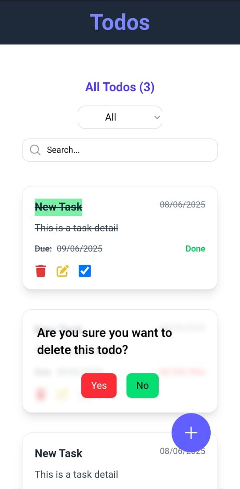
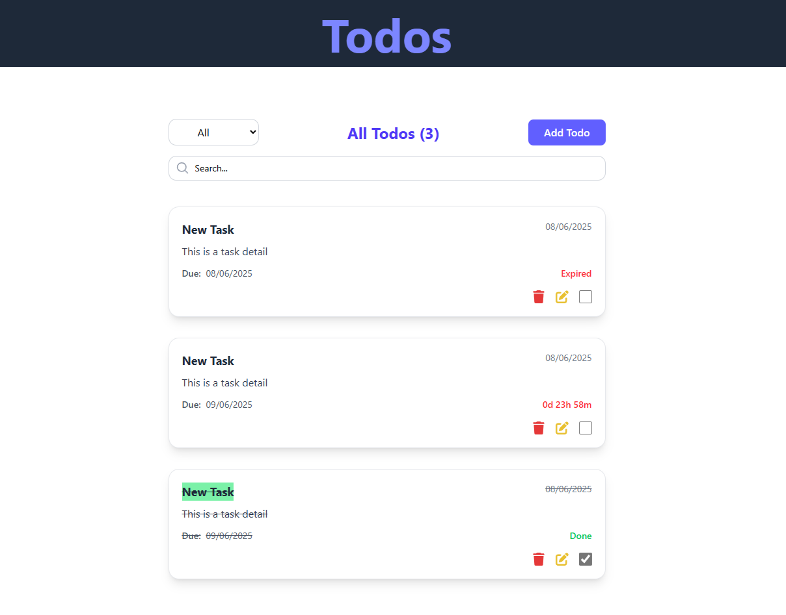

# 📝 Todo List App

A modern, mobile-responsive **Todo List App** built with **Angular**, **Tailwind CSS**, and **IndexedDB** for persistent client-side storage. It includes advanced features like live countdown timers, search & filtering, pagination, and full CRUD (Create, Read, Update, Delete) functionality. The project is fully containerized with Docker and CI/CD automated using **GitHub Actions**, pushing builds to **Docker Hub** and **GitHub Container Registry**, with tagged version releases.

<br>

## 📸 Screenshots

| Mobile View | Desktop View |
|-------------|--------------|
|  |  |

<br>

## 🚀 Features

- ⚡ **Offline-first** with IndexedDB (user data stored locally)
- 📱 Fully **responsive UI** (Mobile + Desktop)
- 🔍 **Search and filter** todos by title or due date
- 📆 **Pagination** for long lists
- ⏳ **Live countdown timer** per todo
- 🧠 **Edit/Delete** todos
- 📦 **Dockerized** build with multi-platform support
- 🔄 **CI/CD pipeline** via GitHub Actions
- 🐋 Pushes to **Docker Hub** and **GHCR**
- 🏷️ **GitHub Releases** for each version

<br>

## 🛠️ Tech Stack

- **Frontend:** Angular (Standalone Components), TypeScript
- **Styling:** Tailwind CSS
- **Storage:** IndexedDB (via Angular IndexedDB wrapper)
- **CI/CD:** GitHub Actions
- **Containers:** Docker
- **Registries:** Docker Hub & GitHub Container Registry

<br>

## 🧪 Run Locally

### Prerequisites
- Node.js
- Angular CLI
- Docker (optional for container run)

### Clone the repo
```bash
git clone https://github.com/yourusername/todo-app.git
cd todo-app

npm install
ng serve
```

```bash
docker build -t todo-app .
docker run -itd --name todo-app -p 8080:80 todo-app
```

<br>

## 🚢 Deployment & CI/CD
This project uses GitHub Actions for automated build and deployment.

### Pipeline Features:
- Runs on push to **main**
- Builds Angular app
- Creates Docker image
- Pushes to Docker Hub and GHCR
- Creates GitHub release with downloadable build

CI config is located in **.github/workflows/main.yml**

<br>

## 🐳 Docker

[Docker repo](https://hub.docker.com/r/rashmithadesilva/todo-app)
[Github container registry](https://github.com/RashmithaDeSilva/TodoList/pkgs/container/todo-app)

Build Image
```sh
docker build -t todo-app .
```

Run Container
```sh
docker run -itd --name todo-app -p 8080:80 todo-app
```

Pull from Registry
```sh
docker pull rashmithadesilva/todo-app:latest
docker run -itd --name todo-app -p 8080:80 rashmithadesilva/todo-app:latest
```

<br>

## 📦 Download Releases

Find compiled versions of the app under the [Releases tab](https://github.com/RashmithaDeSilva/TodoList/releases).

<br>

## 🤝 Contributing

Contributions are welcome! Please open an issue or submit a PR.

<br>

## 📄 License

MIT License. See [LICENSE](https://github.com/RashmithaDeSilva/TodoList/blob/main/LICENSE) file.

